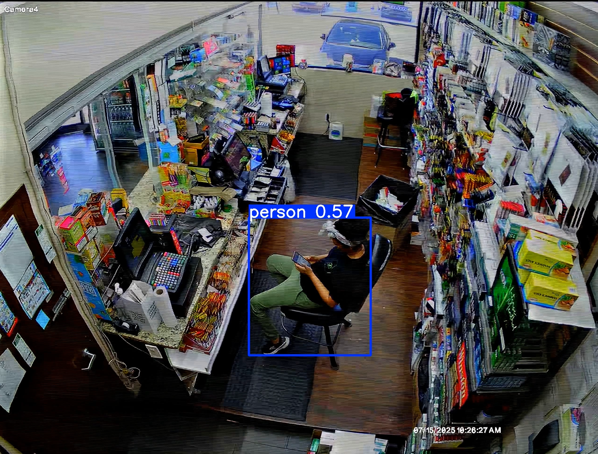
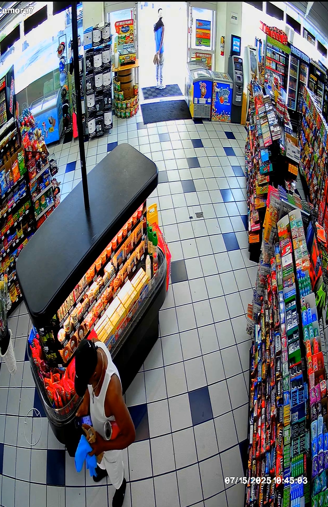
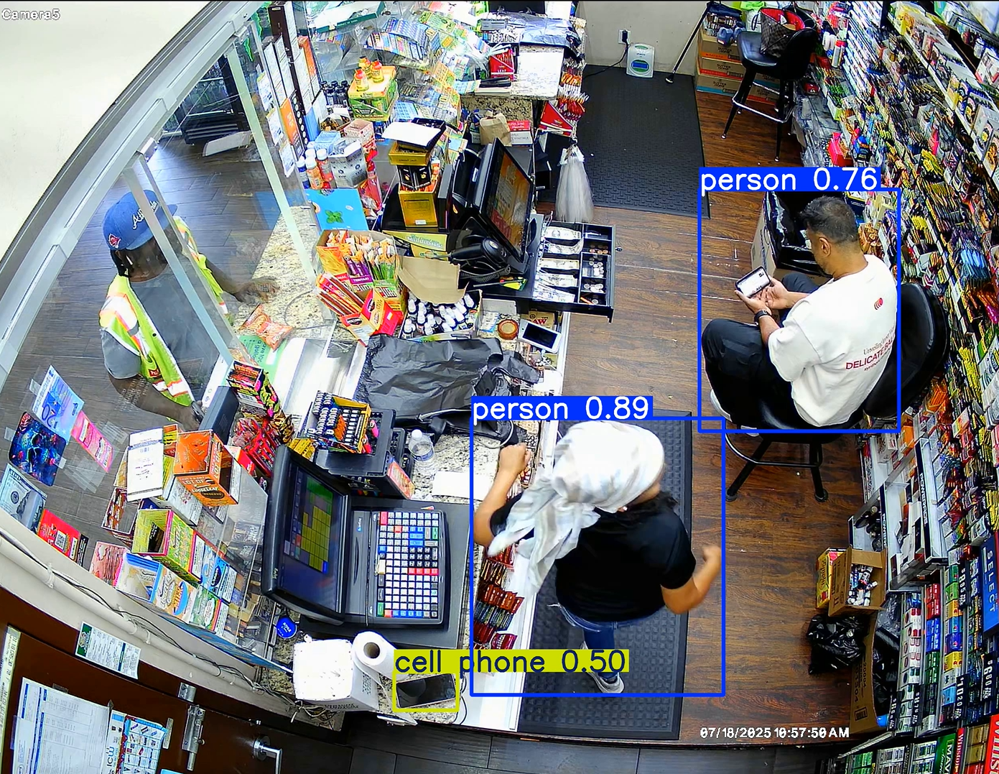
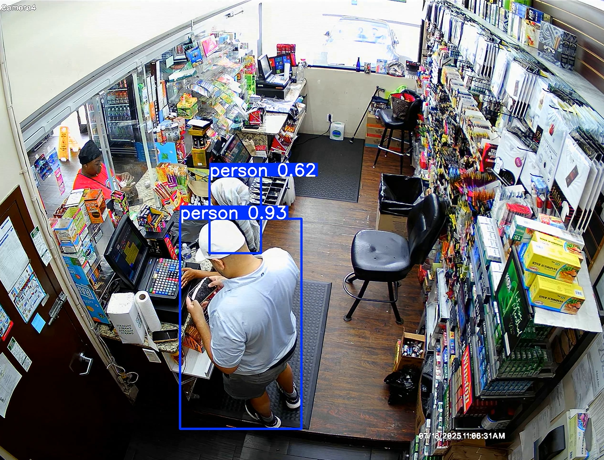
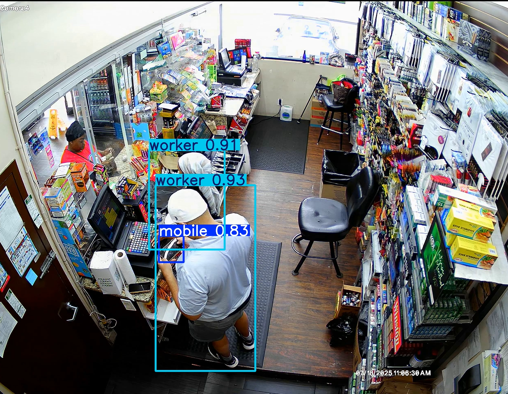
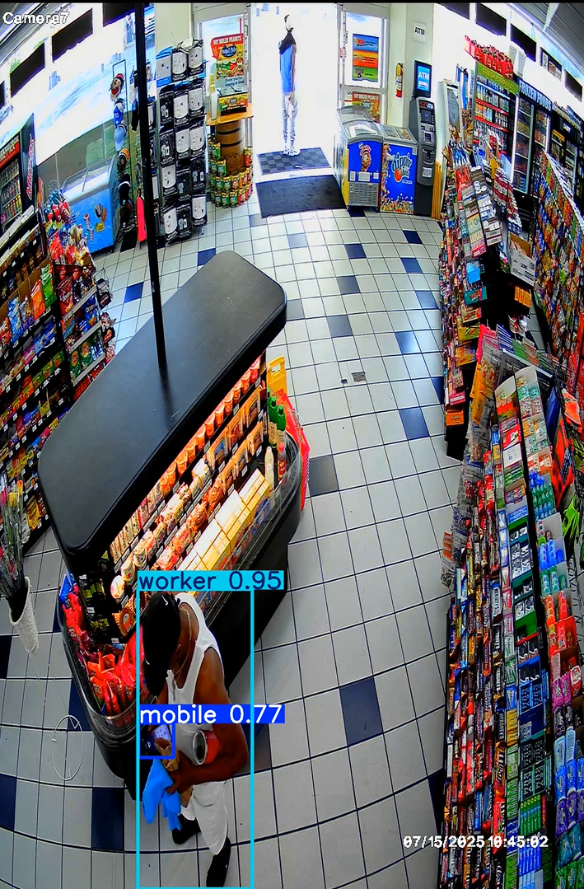
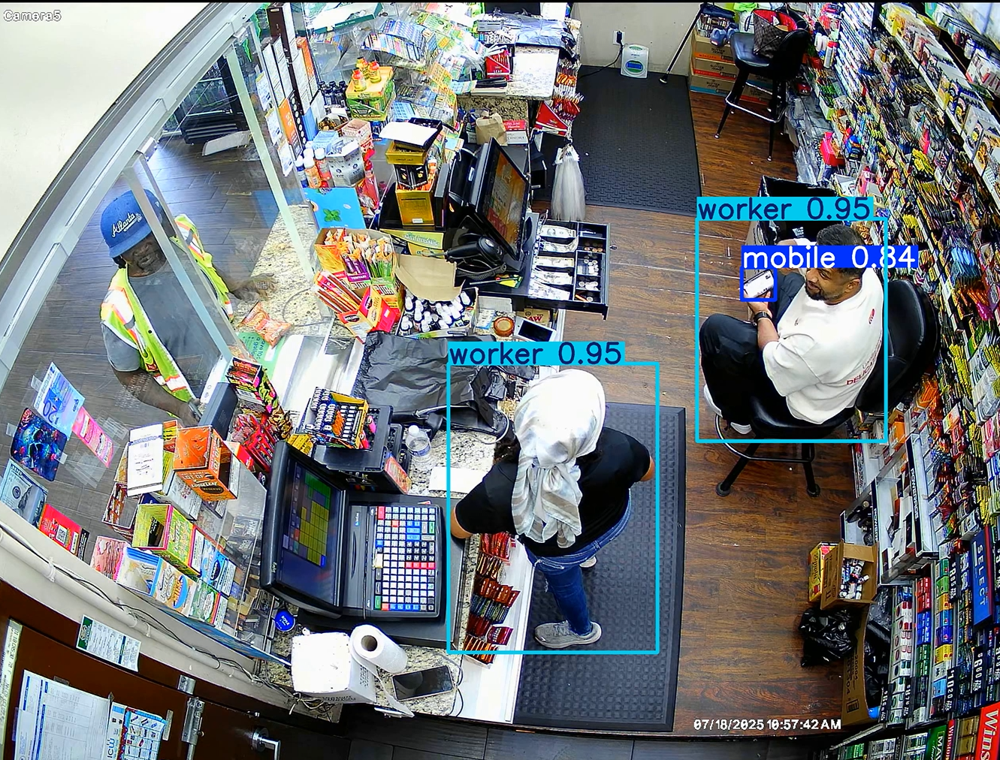

# Mobile Activity Monitoring
In modern retail environments, employee productivity and customer service quality play a crucial role in overall store performance. However, the increasing use of mobile phones during work hours can lead to distractions, reduced efficiency, and a negative impact on customer experience. To address this challenge, mobile activity detection systems are being developed to monitor and analyze employee behavior in retail stores.

The objective of this project is to build an intelligent computer vision–based system that can detect and classify mobile phone usage activities, such as calling, texting, or browsing—by employees during working hours. Using techniques like object detection, action recognition, and deep learning models, the system can automatically identify instances of mobile usage in real time from CCTV footage.

Such monitoring enables store managers to gain insights into employee activity patterns, enforce compliance with workplace policies, and ensure better customer engagement, ultimately improving operational efficiency and customer satisfaction.

1. [About the Data](#about-the-data)
2. [Limitations With Pretrained Model](#limitations-with-pretrained-model)
3. [Need of Fine-Tuning](#need-of-fine-tuning)
4. [Preprocessing and Model Training](#preprocessing-and-model-training)
6. [Evaluation Metrics](#evaluation-metrics)
7. [Inference Results](#inference-results)
8. [Using Mediapipe for Tracking Mobile Usage](#using-mediapipe-for-tracking-mobile-usage)

## About the Data
- The dataset consists of **6 videos** in formats such as MP4, AVI, MOV, and MKV.
- Out of these, **4 videos** were used for **training**, **1 video** for **validation** and **1 video** for **testing** on unseen data.
- The dataset was annotated using **Roboflow**, and the annotations were exported in the **YOLOv11** format.

## Limitations With Pretrained Model
- The pre-trained model shows **inconsistent performance** in detecting mobile phones, making it **unreliable** for tracking actual mobile usage by workers.

- Worker detection is also **inconsistent** across different videos, leading to gaps in accurate monitoring.
  
- The model detects **static/idle** mobile phones (e.g., placed on tables), which are **not relevant** for this project, since the focus is only on **active mobile usage** by workers.
  

## Need of Fine-Tuning

Given the limitations of pre-trained models, fine-tuning becomes essential to adapt the model for the specific requirements of this project:

- **Domain Adaptation**: Pre-trained models are trained on generic datasets (e.g., COCO, Open Images), which may not fully represent the environment and conditions of our retail store videos. Fine-tuning on custom-labeled data ensures the model learns domain-specific features.
- **Improved Accuracy**: Fine-tuning helps reduce inconsistencies in detecting workers and mobile phones, leading to more reliable monitoring.
- **Task-Specific Filtering**: By training on annotated data that excludes static mobiles, the fine-tuned model can focus only on detecting active mobile usage, which is the core requirement of this project.
- **Robustness Across Variations**: Fine-tuning improves performance across different video qualities, lighting conditions, and camera angles present in the dataset.

## Preprocessing and Model Training
To ensure better generalization and robustness, the dataset was preprocessed and augmented before model training. The following steps were applied:

### Preprocessing

- **Histogram Equalization**: Applied to achieve uniform image contrast across frames.

- **Data Augmentation**

  -  **Horizontal Flip**: To simulate **mirrored** viewpoints of workers.

  - **Blur(Up to 0.8 px)**: To handle **slight motion blur** in videos.

  - **Noise(Up to 4.21% of pixels)**: To make the model robust against noisy video frames.

  - **Mosaic Augmentation**: To improve context learning by combining multiple images into one.

- **Bounding Box Augmentations**:

  - **Brightness Adjustment**: Between 0% and +37% to account for varying lighting conditions.

  - **Blur** – Up to 0.6 px applied within bounding boxes for robustness.
 

### Model Training

- The model was trained using **YOLOv11**.

- Input image size was set to **1088 × 1088** for improved **generalization** and detection **accuracy**.

- Training was conducted on the **annotated** dataset exported from **Roboflow**.

## Evaluation Metrics  
The performance of the fine-tuned **YOLOv11s** model was evaluated on the test dataset consisting of **180 images** from the test video.  

| Class   | Precision (P) | Recall (R) | mAP@50 | mAP@50-95 |
|---------|---------------|------------|--------|-----------|
| Mobile  | 0.997         | 0.993      | 0.995  | 0.839     |
| Worker  | 0.997         | 0.999      | 0.995  | 0.897     |
| Overall | 0.997         | 0.996      | 0.995  | 0.868     |

### Key Observations

- The model achieved **very high precision** and **recall** (**≥0.99**) for both classes, indicating reliable detection with minimal false positives/negatives.

- **mAP@50** is consistently **0.995**, reflecting strong object localization.

- **mAP@50-95** scores are slightly lower (0.839 for mobile, 0.897 for worker), which is expected due to stricter IoU thresholds, but still demonstrate excellent performance.

- The fine-tuned model significantly improves over pre-trained baselines, particularly in filtering out static mobiles and ensuring consistent worker detection.

## Inference Results  

Below are sample comparisons of inference results using the **pre-trained model** and the **fine-tuned model**:  

| Image | Pre-trained Model | Fine-tuned Model |
|-------|------------------|------------------|
| Sample 1 |  |  |
| Sample 2 |  |  |
| Sample 3 |  |  |

### Observations  
- **Pre-trained model**: Inconsistent detection of workers and mobile phones; static mobiles also get detected.  
- **Fine-tuned model**: More consistent worker detection, only active mobile usage is detected, and false positives are reduced.  
